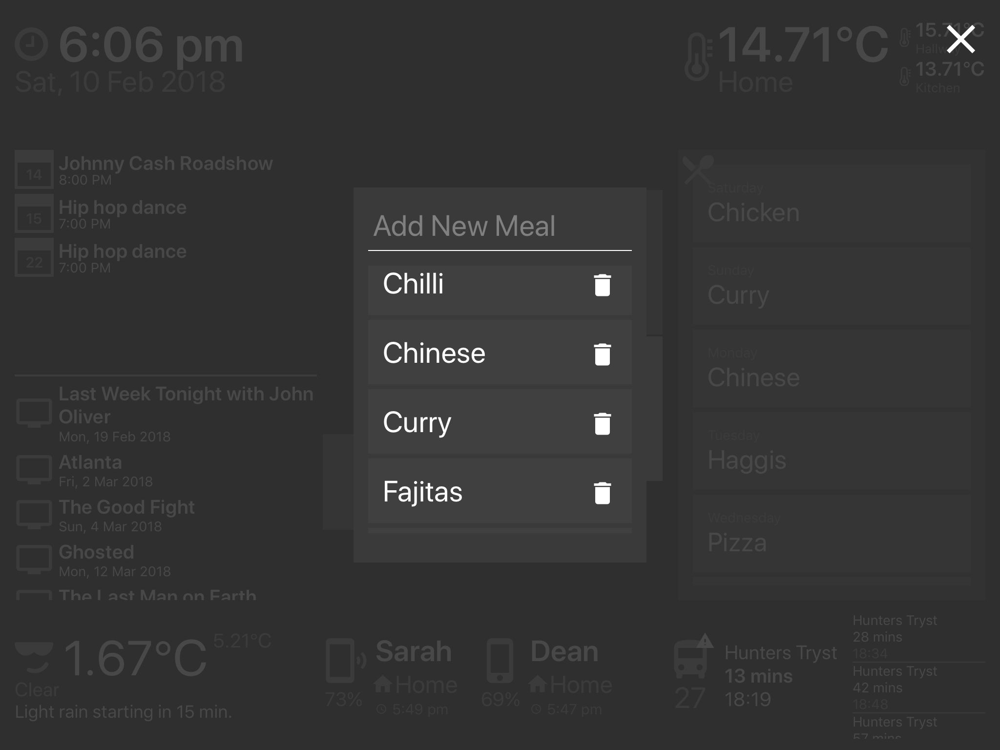

# The home of the future!

I'm obsessed with controlling my home. Once you get into home automation it's a slippery slope. One minute you're bookmarking potential ideas, the next you're asking the in-laws to get you light bulbs for Christmas.

With an iPad that was just otherwise lying around doing nothing, I wanted to build a dashboard that would passively give info about what's going on in and around the home. I had only had two goals in mind when I started this project: 

- The app should be entirely self-contained. Requests should originate from and be processed on the iPad. I didn't want to have an additional dependency of a server.
- Try as much as possible to avoid the terrible, huge-icon, '90s home pad interfaces. Information should be available at a glance rather than behind a couple of screens.

That being said, I'll let you be the judge of how I fared.

The app is built entirely in React-Native. All the source code is available [here](https://www.github.com/deanhet/home-dashboard). It's structured in such a way that each 'widget' on the page is self contained with its own actions and views. It should hopefully be easy enough to see what each part is doing on its own. You should be able to pull and build the app yourself, although not much will come up if you don't fill out the required info in `keys.js`.

## Integrations
- [Clock](#clock)
- [Spotify](#spotify)
- Hue
    - [Sensors](#hue-sensors)
    - [Lights](#hue-lights)
- [Bus Tracker](#bus-tracker)
- [Meal Plan](#meal-plan)
- [Weather](#weather)
- [iCloud Find my iPhone](#find-my-iphone)
- [TV Schedule](#tv-schedule)
- [Calendar events](#calendar-events)
- [Screensaver](#screensaver)

## Frameworks and dependencies
- [React-Native](https://facebook.github.io/react-native/)
- [react-gateway](https://github.com/cloudflare/react-gateway)
- [react-native-calendar-events](https://github.com/wmcmahan/react-native-calendar-events)
- [react-native-vector-icons](https://github.com/oblador/react-native-vector-icons)
- [redux](https://redux.js.org/docs/introduction/)
- [redux-persist](https://github.com/rt2zz/redux-persist) (AsyncStorage)
- [react-native-md5](https://www.npmjs.com/package/react-native-md5)

### Clock
Shows the current time, day, date and year.

The core of this component is just a setInterval loop that runs every second. I wanted to avoid a heavy library like [moment](https://momentjs.com/) just to format time so I made extensive use of `Date.toLocaleString`. Turns out that Javascript has a lot of useful built-in functions for formatting Dates.

### Spotify
Shows the currently playing Artist and Song

<video src="assets/videos/currently-playing.mp4" width="100%" loop controls muted height="100" preload></video>

If a song is currently playing, a bar will slide up showing song info. I eventually added next/previous controls after giving the app some real-life use. The Spotify API doesn't currently offer a websocket/constant connection so the app pings a request every 15 seconds. It's not an ideal solution and I'd love to change away from this approach.

### Hue Sensors

My entire home is kitted out with Hue lights and a couple of motion sensors to automatically trigger them. It seems to be little advertised but the [Hue Motions Sensors](https://www2.meethue.com/en-us/p/hue-motion-sensor/046677473389) can also measure temperature and light levels. This component takes the temperature in my hall and kitchen every 5 minutes. The main home temperature is just an average of the two. The thermometer icons will change depending on each temperature.

### Hue Lights
Buttons to toggle lights on and off and change brightness. Light states are also frequently polled just in case a light is turned on outside of the app.

This component went through a lot of work before I settled on the final design. After sharing some early screenshots with friends, they gave me the idea for the 'floorplan'. As you can see below, it went through some very ugly prototypes before landing on the final design.

Touching a room will switch the lights on/off in that room. You can also hold and drag over room to change the brightness. This uses a lot of [PanResponder](https://facebook.github.io/react-native/docs/panresponder.html) to handle the dragging.

<video src="assets/videos/light-dimmer.mp4" width="100%" controls loop muted height="400" preload></video>

### Bus tracker
Shows when the next bus is at nearest stop with a scrollable panel of future buses. A warning icon will show if there are delays or problems on the route.

In this case, I'm only particularly interested in the bus that goes into the city centre. Luckily, the council provides a nice API for tracking buses in my area. 

I requested a key during a weekend so while waiting for a response I 'borrowed' a couple of other apps keys by decompiling an Android app using [apktool](https://ibotpeaches.github.io/Apktool/) and listening for network requests using [mitmproxy](https://mitmproxy.org/).

They're both a good way to feel like Mr Robot and both worth exploring further in a future blog post. I developed against the keys and quickly swapped in my own when I got a reply first thing on the Monday (credit to the council for the quick reply!).

### Meal Plan
Shows the upcoming meals for the week. List order rotates so the current day is always at the top.

Should have probably came up with a more healthy example for the screenshot, green things were eventually added! It was surprisingly tricky to settle on an interface for this. This component has the ability to add and remove new meals and assign them to days. It got a lot easier once I decoupled the concepts and started treating them as two separate things.

First attempt:

I eventually settled on a modal that shows when a day is pressed. 

### Weather
Shows the current weather (apparent and actual temperature), with summary and forecast for the next hour.

Making use of the great [Dark Sky](https://darksky.net) API, this component provides a lot of value for not a lot of effort. I opted to make the 'feels like' temperature more prominent than the actual temperature. It's no use being prepared for it to be 15 degrees outside when it actually feels a lot colder than that. The API also returns what kind of icon should be shown so that gets matched up with a custom icon font that I built using [fontello](http://fontello.com/).

### Find my iPhone
Shows current battery percentage and location of our phones with the last time their location was updated at. It also has the ability to ping a device too.

Apple doesn't provide any external API for Find my iPhone. They do however provide a web interface for it at [icloud.com](https://www.icloud.com). The large majority of this work was just sitting with a network inspector open and playing with the web interface. Eventually I boiled the requests down to what I needed. The app mimics those requests so it can access everything that Apple's own web interface can.

When a phone icon is pressed a (loud) alert is sent to the phone, even when it's on silent. Super handy since we always seem to be losing our phones around the house.

<video src="assets/videos/find-phone.mp4" controls width="100%" height="400" preload></video>

Apple returns coordinates for the phone location so once that's returned it's piped through Google maps to get a more readable walking time and distance away from home.

### TV Schedule
Show upcoming TV shows.

I run a home server for [Plex](https://www.plex.tv) that also runs an instance of [SickBeard](http://sickbeard.com/). SickBeard provides a nice API to get the future schedule of shows I'm watching. Updates once a day.

### Calendar events
Shows a list of scrollable upcoming shared calendar events for the next two weeks.

We use a shared iCloud calendar at home so it's dead handy to see what's coming up. Since the iPad is logged in to my account, I can just use native code to access the accounts calendar. I originally started writing my own native integration in Swift but as is normally the case with date and times, it's not a lot of fun. I ended up using the fantastic [react-native-calendar-events](https://github.com/wmcmahan/react-native-calendar-events) library.

### Screensaver
The time bouncing from left to right.

I'm not too concerned about burn-in on the iPad's screen but I added a screensaver just to be on the safe side. Since the app is aware of its surroundings it will only trigger the screensaver if the lights are off for more than 15 minutes. The main interface can be brought back just by touching the screen anywhere.

## Contact
I'd be more than happy to answer any questions about any of the above. You can leave an issue on the github [here](https://github.com/deanhet/home-dashboard/issues) or get me on Twitter [@deanhet](https://www.twitter.com/deanhet).

